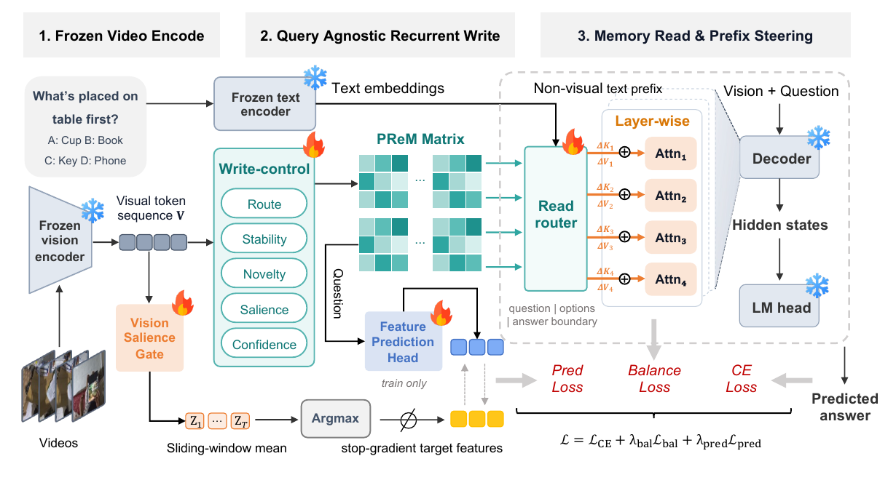
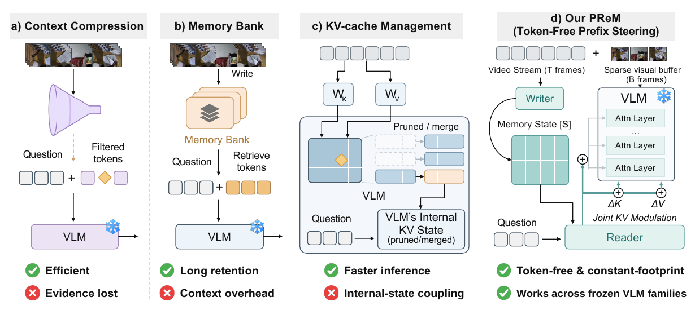

# PReM: Prefix-Steered Recurrent Memory for Long-Video Understanding

Official implementation of **PReM: Prefix-Steered Recurrent Memory for Long-Video Understanding**.

[](https://arxiv.org/abs/2609.23601)
[](LICENSE)

[Installation](#installation) · [Data](#data) · [Training](#training) · [Evaluation](#evaluation) · [Citation](#citation)



PReM gives frozen vision-language models a compact recurrent memory for long-video understanding. A query-agnostic writer ingests the video once; a question-conditioned reader then steers existing non-visual prefix key/value representations during prefill. The same memory can serve multiple questions.

- **No extra memory tokens:** the visual buffer stays within a fixed frame budget.
- **Constant memory footprint:** four `128 × 128` FP32 slots occupy approximately **256 KiB**, independent of video length.
- **Frozen backbone:** train only the memory and steering modules.
- **Offline and streaming inference:** streaming carries memory state and confidence across chunks and answers at the end of the video.

<details>
<summary>Comparison with other memory interfaces</summary>



Figures 1–2 from the [paper](https://arxiv.org/pdf/2609.23601).

</details>

## Supported backbones

| Backbone | Training `MODEL_TYPE` | End-to-end launcher |
| --- | --- | --- |
| Qwen2.5-VL-3B | `qwen2_5vl` | `scripts/run_prem_kv_qwen25_3b.sh` |
| Qwen3-VL-8B | `qwen3vl` | `scripts/run_prem_kv_qwen3_8b.sh` |
| LLaVA-Video-7B | `llava_video` | `scripts/run_prem_kv_llava_7b.sh` |

These three frozen backbones are evaluated in the paper. The repository also includes a Qwen2-VL integration (`MODEL_TYPE=qwen2vl`).

## Layout

```text
models/             # Recurrent memory, backbone adapters, and baselines
scripts/train/      # Training entry points
scripts/eval/       # Offline and streaming evaluation
scripts/analysis/   # Case-study analysis
scripts/run_*.sh    # Experiment launchers
tests/              # Contract and smoke tests
```

## Installation

The training and evaluation scripts use CUDA. The original environment setup is provided in `setup.sh` (Python 3.10.14, PyTorch 2.6.0, torchvision 0.21.0, and Transformers 4.57.1).

```bash
git clone https://github.com/siruzhong/PReM.git
cd PReM
bash setup.sh
conda activate prem
```

Run commands from the repository root. FlashAttention can be installed from a wheel compatible with your CUDA, PyTorch, and Python versions. The LLaVA-Video adapter loads the upstream [LLaVA-NeXT](https://github.com/LLaVA-VL/LLaVA-NeXT) source from `external/baselines/llava_next` and a local SigLIP vision tower from `ckpt/siglip-so400m-patch14-384`.

## Data

Training uses a decontaminated subset of [LLaVA-Video-178K](https://huggingface.co/datasets/lmms-lab/LLaVA-Video-178K) (6,430 videos / 17,849 QA pairs). Expected layout:

```
data/llava-video-178k/trainset_9k.jsonl
data/llava-video-178k/frames/...
```

### Benchmarks

Download each benchmark from its original source. The default annotation paths below are relative to `data/eval_video/`:

| Benchmark | Annotation path | Media path |
| --- | --- | --- |
| [LongVideoBench](https://github.com/longvideobench/LongVideoBench) | `LongVideoBench/raw/lvb_val.json` | `LongVideoBench/frames/` or `LongVideoBench/videos/` |
| [MLVU](https://github.com/JUNJIE99/MLVU) | `mlvu/test_qa.json` | `mlvu/videos/` |
| [Video-MME](https://github.com/MME-Benchmarks/Video-MME) | `videomme/test_qa.json` | `videomme/Video-MME/data/` |
| [EgoSchema](https://github.com/egoschema/EgoSchema) | `EgoSchema/test_qa.json` | `EgoSchema/videos/` |
| [MVBench](https://github.com/OpenGVLab/Ask-Anything/blob/main/video_chat2/MVBENCH.md) | `mvbench/test_qa.json` | `mvbench/videos/` |
| [LVBench](https://github.com/zai-org/LVBench) | `lvbench/test_qa.json` | `lvbench/videos/` |

Video-MME is evaluated without subtitles. The LongVideoBench offline runner uses frames with a video fallback; the streaming runner uses `LongVideoBench/videos/`. Backbone checkpoints are expected under `ckpt/`, for example `ckpt/Qwen2.5-VL-3B-Instruct`.

### Annotation format

Training accepts LLaVA-style JSON or JSONL conversations, with media paths relative to `VIDEO_ROOT`:

```json
{"video": "clip_001.mp4", "conversations": [{"from": "human", "value": "<video>\nWhat happens first?"}, {"from": "gpt", "value": "A person opens the door."}]}
```

Evaluation accepts JSON arrays or JSONL records. A normalized MCQ record uses a zero-based answer index and labeled options:

```json
{"id": "clip_001_q1", "video": "clip_001.mp4", "question": "What happens first?\n(A) A door opens\n(B) A light switches on", "answer": 0}
```

LongVideoBench records with `candidates` and `correct_choice` are also supported. Annotation filenames and media roots are defined in `scripts/eval/run_eval_offline.py` and `scripts/eval/run_eval_online.py`. The filtered paper training manifest and trained adapter checkpoints are not bundled in this repository.

## Training

Example: train PReM on Qwen2.5-VL-3B (`K=4`, `d_v=d_k=128`, writer cap `T=64`, visual buffer `B`, evidence prediction on):

```bash
MODEL_TYPE=qwen2_5vl \
MODEL_PATH=ckpt/Qwen2.5-VL-3B-Instruct \
OUT_DIR=outputs/prem_attention/qwen25 \
DATA_FILE=data/llava-video-178k/trainset_9k.jsonl \
VIDEO_ROOT=data/llava-video-178k/frames \
NUM_SLOTS=4 MEM_DIM=128 PREM_LAYER_GROUPS=1 PREM_MODULATION=attention_kv \
MAX_FRAMES=64 VISUAL_BUFFER_FRAMES=16 MAX_PIXELS=200704 \
PRED_WEIGHT=0.2 PRED_TOKENS=4 ROUTER_GAMMA=0.10 \
LR=2e-4 SEED=13 \
bash scripts/train/run_train.sh
```

`run_train.sh` launches distributed training. Use `RESUME=1` to resume an existing checkpoint.

The end-to-end launchers sweep decoder budgets and steering strengths. Their defaults differ by backbone and include search configurations (the Qwen2.5 launcher defaults to `K=1`, `G=4`, and EgoSchema). Inspect or override their environment variables for the experiment you intend to run:

```bash
bash scripts/run_prem_kv_qwen25_3b.sh   # Qwen2.5-VL-3B
bash scripts/run_prem_kv_qwen3_8b.sh    # Qwen3-VL-8B
bash scripts/run_prem_kv_llava_7b.sh    # LLaVA-Video-7B
```

## Evaluation

The unified harness `scripts/eval/run_eval.sh` dispatches to the offline (`run_eval_offline.py`) and streaming (`run_eval_online.py`) runners. The paper protocol uses 1 FPS, a writer ingestion cap of `T=240` frames, `max_pixels=200704`, one-token constrained decoding over option letters, and a macro average over the six benchmarks.

```bash
# Offline (full-video) evaluation of a trained checkpoint
EVAL_MODE=offline MODEL_FAMILY=qwen25 OFFLINE_MODEL=prem \
MODEL_PATH=ckpt/Qwen2.5-VL-3B-Instruct PREM_CKPT=outputs/prem_attention/qwen25/prem.pt \
MAX_FRAMES=240 PREM_MODULATION=attention_kv DATASETS=longvideobench,mlvu,videomme,egoschema,mvbench,lvbench \
bash scripts/eval/run_eval.sh

# Streaming (end-of-stream) evaluation
EVAL_MODE=online MODEL_FAMILY=qwen25 ONLINE_MODEL=prem \
MODEL_PATH=ckpt/Qwen2.5-VL-3B-Instruct PREM_CKPT=outputs/prem_attention/qwen25/prem.pt \
MAX_FRAMES=240 PREM_MODULATION=attention_kv DATASETS=longvideobench,mlvu,videomme,egoschema,mvbench,lvbench \
bash scripts/eval/run_eval.sh
```

The decoder budget `B` is read from the PReM checkpoint, independently of the writer cap `MAX_FRAMES`. The Qwen harness above supports Qwen2, Qwen2.5, and Qwen3; use `scripts/eval/eval_prem_llava_video.py` or the LLaVA launcher for LLaVA-Video.

## Acknowledgements

This implementation builds on [Qwen](https://github.com/QwenLM/Qwen3-VL), [Transformers](https://github.com/huggingface/transformers), and [LLaVA-NeXT](https://github.com/LLaVA-VL/LLaVA-NeXT). The repository includes [Flash-VStream](https://github.com/IVGSZ/Flash-VStream) baseline code. We thank their authors and the benchmark creators for making their work available.

## Citation

```bibtex
@article{zhong2026prem,
  title={PReM: Prefix-Steered Recurrent Memory for Long-Video Understanding},
  author={Zhong, Siru and Wang, Qiongyan and Lv, Xiaohui and Zhuang, Yuzheng and Tao, Shuai and Liu, Wulong and Fu, Haohuan and Liang, Yuxuan},
  journal={arXiv preprint arXiv:2609.23601},
  year={2026},
  doi={10.48550/arXiv.2609.23601},
  url={https://arxiv.org/abs/2609.23601}
}
```

## License

PReM code is released under the [MIT License](LICENSE). Third-party components retain their original licenses; consult the original licenses of any third-party backbone or dataset.
